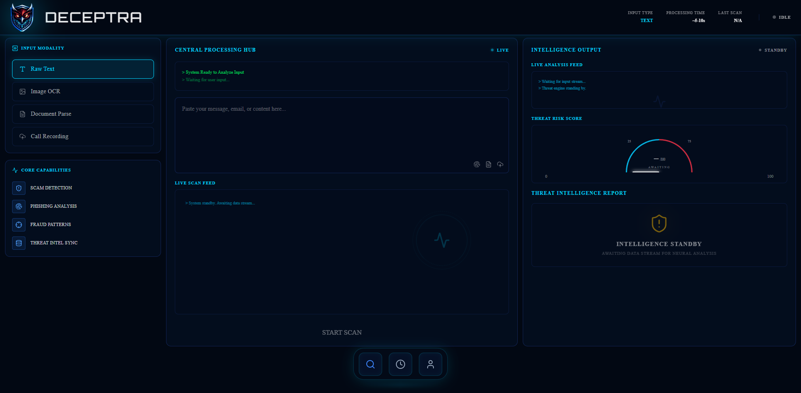
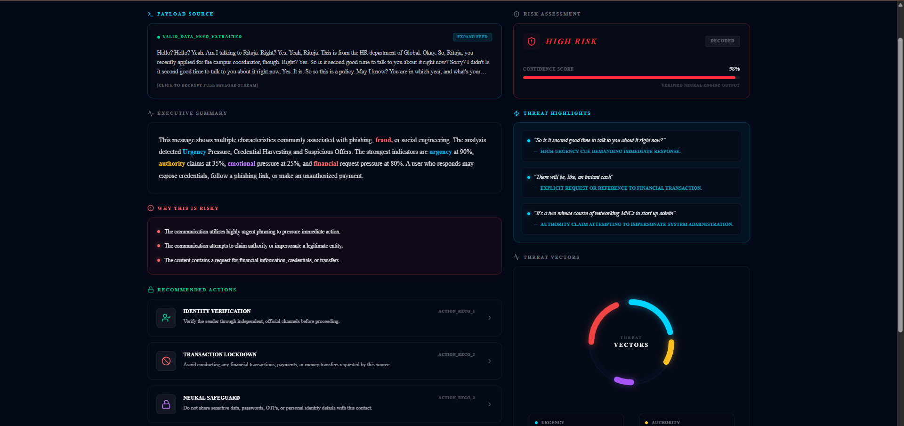

# DECEPTRA

AI-Powered Deception Risk Intelligence Platform built to analyze suspicious patterns across text, images, documents, and call recordings.

DECEPTRA combines OCR, AI-based threat analysis, document parsing, and audio intelligence into a futuristic cyber-intelligence dashboard.

---

## Features

- Text Risk Analysis
- OCR Image Analysis
- Document Parsing
- Call Recording Analysis
- AI-Powered Risk Scoring

---

## Tech Stack

- Next.js
- TypeScript
- Tailwind CSS
- Flask
- SQLite
- Gemini AI
- Deepgram
- Tesseract.js
---
## Dashboard



---

## Threat Analysis Report



---


## Setup

```bash
git clone https://github.com/your-username/DECEPTRA.git
```

```bash
pnpm install
pnpm dev
```

```bash
pip install -r requirements.txt
python app.py
```

---

**DECEPTRA — Intelligence Beyond Detection.**
